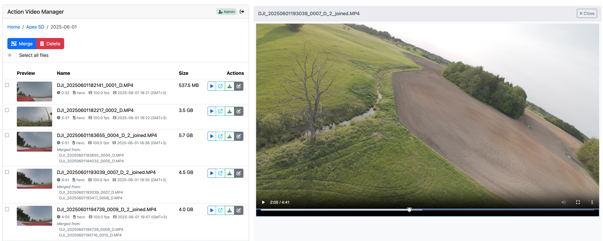
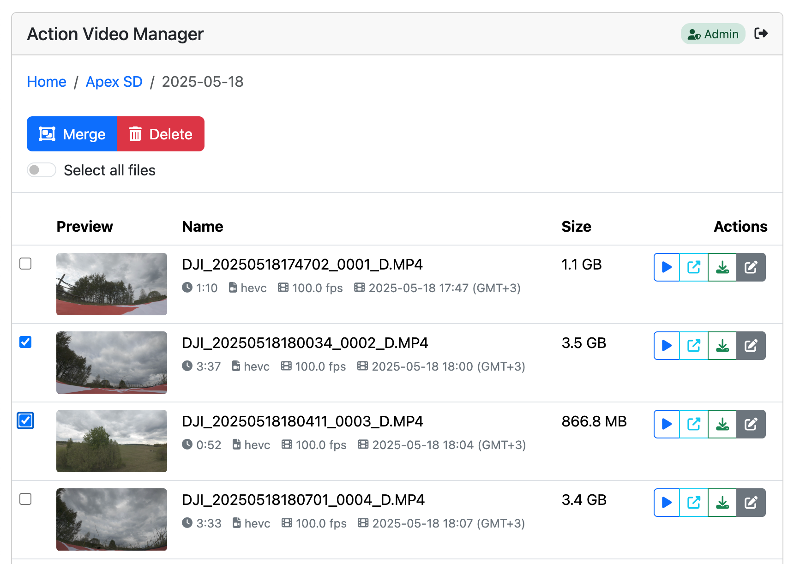
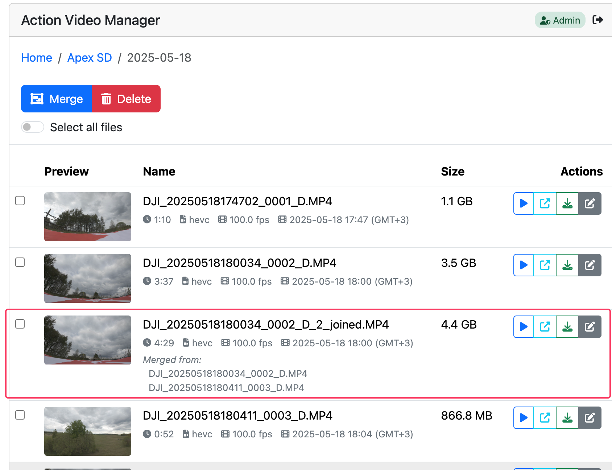

# Action Video Manager

Welcome to Action Video Manager (AVM) — tool for managing drone and action cam footage, especially when it's stored on a Network Attached Storage (NAS) with docker support. 

This project is all about making your (my, actually) life easier and solving some of those issues with storing and merging your videos.

## Why
- **Tired of Split Files?**: DJI Air Units and certain action cams chunk videos into 3.5GB files, which means lots of files for longer flights. AVM makes it simple to combine them, so you get a neat "one flight, one file" situation.
- **Smooth Stabilization**: If you’re using [Gyroflow](https://gyroflow.xyz/) for stabilizing your video, it works best if files are merged first. No more weird jumps or jolts between 2 stabilized files!
- **Pre-merging**: Waiting for files to download and merge on your PC can be a painful. AVM helps you start gyroflow process faster by merging those files in advance.
- **No More Typing Command Hassles**: Using Gyroflow’s merge tool via SSH can be a pain. AVM brings a user-friendly interface so you can just point, click, and get on with it.

## Features
- Video/Audio/Images playback
- Downloading of video files
- Merging video files using [Gyroflow's mp4_merge](https://github.com/gyroflow/mp4-merge)
- Renaming and deleting of files
- Optional redis support (for login sessions)
- Single-admin to keep it simple

## How It Looks
**Main Interface**


**Pick Your Files and Merge Away**


**Merged Files, Ready to Go!**


## Possible setups

### NAS with docker support
- Utilize Synology DiskStation with the *USB Copy* package for automated file downloading from SD cards, organized into date-specific folders.
- Assign each drone a dedicated SD card, directing its contents to the respective drone folder.
- Leverage the *Container Manager* package on Synology DS to facilitate Docker container operations.
- Use [Portainer](https://www.portainer.io/) for enhanced container management.

### Other Setups
- **NFS Option**: Store files on a NAS accessible via NFS and mount them on a Linux PC/Server.
- **Local Option**: Keep everything on a PC/Server that can run Docker and access media files locally.

## Running AVM

### Quick and Easy Container
```bash
docker run -v /media:/media paidem/avm:latest
```

### Docker Compose Setup
```yaml
services:
  app:
    image: paidem/avm:latest
    ports:
      - "5000:5000"
    volumes:
      - /media:/media
      - /media/avm/thumbnails:/app/static/thumbnails
    restart: unless-stopped
    environment:
      - PYTHONUNBUFFERED=1
      - TZ=Europe/Vilnius
      - ADMIN_PASSWORD=action
```

### Portainer Stack
Use the **portainer-stack-example.yaml** file to get things rolling.

# Docker container
## ENV Variables

| Variable              | What It Does                                                  | Default                                                                                                    |
|-----------------------|---------------------------------------------------------------|------------------------------------------------------------------------------------------------------------|
| **ADMIN_PASSWORD**    | Password to access admin features                             | admin                                                                                                      |
| **FILTERED_FILES**    | Files and folders to skip                                     | .DS_Store,.Thumbs.db,Thumbs.db,._.Trashes,.Spotlight-V100,.fseventsd,.Trashes,@eaDir,desktop.ini,thumbs.db |
| **HIDDEN_EXTENSIONS** | Don't want to see these file extensions                       | source,srt                                                                                                 |
| **PRIVATE_FOLDERS**   | Folders only visible in admin mode                            | Personal                                                                                                   |
| **REDIS_HOST**        | Optional redis host. If specified - will be used for sessions | n/a                                                                                                        |  

## Where Stuff Goes in the Container

| Path                      | What It’s For                                                                                 |
|---------------------------|-----------------------------------------------------------------------------------------------|
| **/media**                | Where all your media goes                                                                     |
| **/app/static/thumbnails** | Thumbnails directory—mount this to keep them even after recreating the container              |

Hope this helps you get started with AVM! If you've got any questions or run into issues, dive into the community or reach out. Enjoy merging and managing your action vids!

# Everything else
## Accessing from internet
You should be careful when exposing this app to internet as lets access all your footage and in case of vulnerabilities - delete your footage.

I recommend using only with IP whitelist or CloudFlare proxy/zero-trust tunnel with google authentication and whitelisted IP (as I do)

## Development
You need [mp4_merge](https://github.com/gyroflow/mp4-merge) and ffmpeg installed in path

## Links
[dockerhub](https://hub.docker.com/r/paidem/avm)